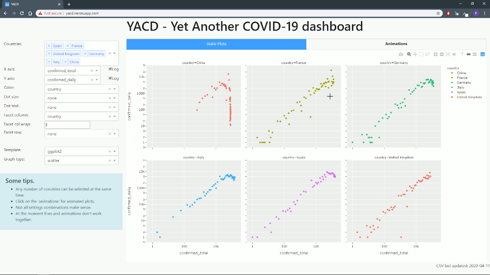
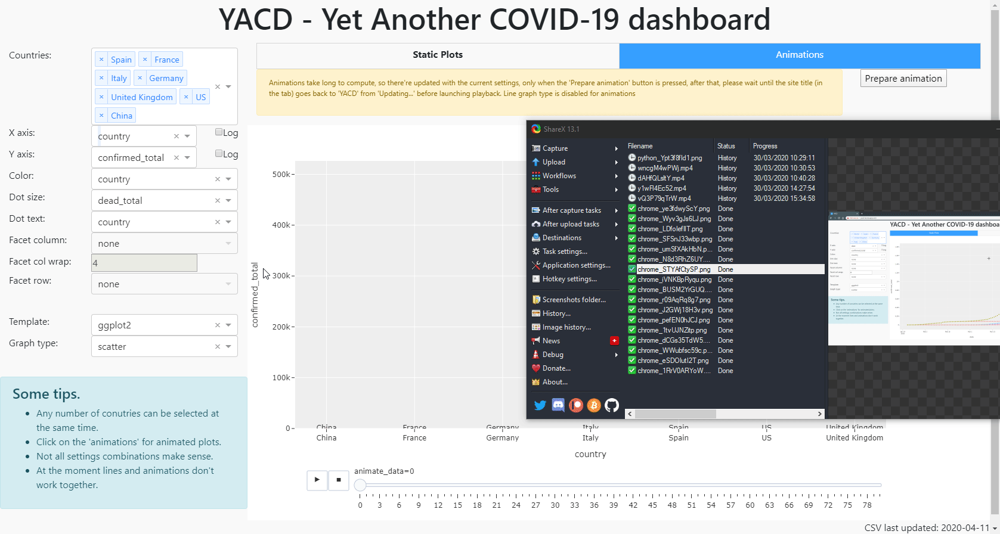

# yacd

## Intro

Yet another COVID-19 dashboard  
You can find this app here http://yacd.herokuapp.com/  
The raw data is extracted from https://github.com/CSSEGISandData/COVID-19

## Description

Yet another COVID-19 dashboard built by yet another data science enthusiast.  
I made this so I can look at the data the way I like, and because I wanted to learn Pandas and Dash to have other options besides Shiny and Tidyverse, but mostly, I'm bored.  

### Static plots

### Animations

## To do

- Merge with countries census data
- Use ipython widgets to build dashboard within jupyter notebook

## Author

Felicià Antoni Maviane Macia
